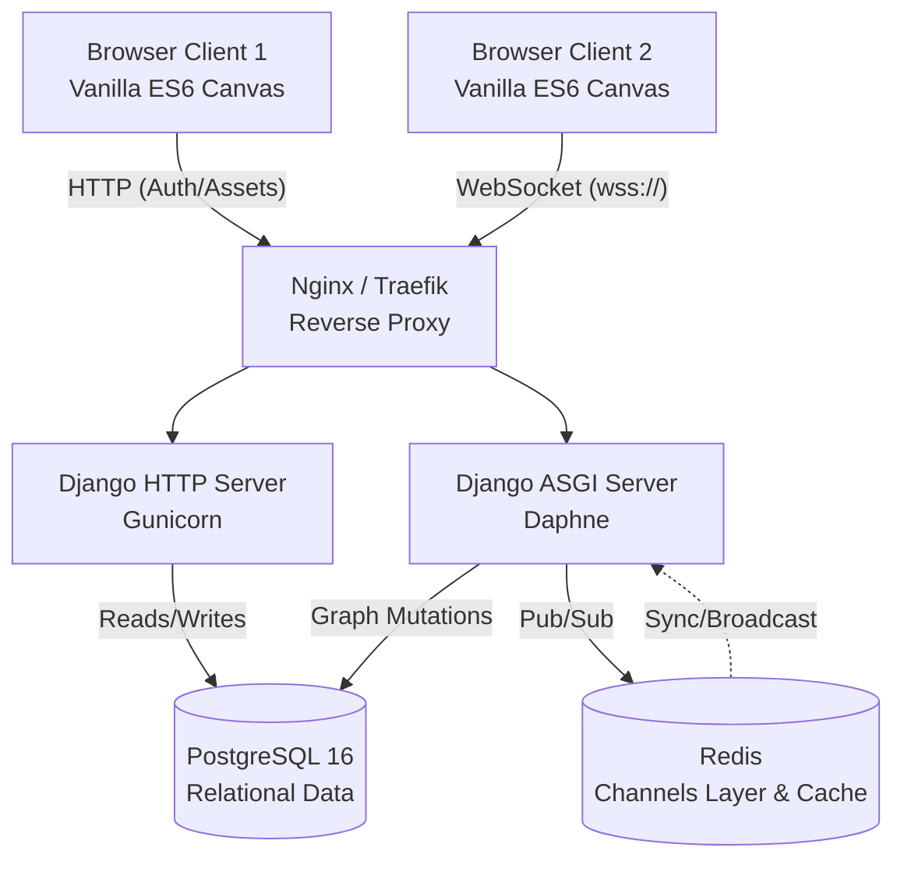

# CollabFlow System Architecture & Design

This document details the architectural decisions, data flows, and scaling considerations for CollabFlow, preparing engineers for system design discussions.

## 1. High-Level Architecture Diagram

## 2. Data Flow: Concurrent Graph Mutation

When two users edit the graph simultaneously, CollabFlow ensures mathematical integrity using Pessimistic Locking.

```mermaid
sequenceDiagram
    participant C1 as Client 1
    participant C2 as Client 2
    participant WS as Daphne (ASGI)
    participant DB as PostgreSQL
    participant Redis as Redis (Channels)

    C1->>WS: {action: "edge.create", source: A, target: B}
    C2->>WS: {action: "node.update", label: "Task X"}
    
    rect rgb(40, 40, 40)
        Note over WS,DB: Transaction 1 (Client 1)
        WS->>DB: BEGIN
        WS->>DB: SELECT * FROM Project WHERE id=1 FOR UPDATE
        Note over DB: Lock Acquired
        WS->>DB: INSERT Edge (A -> B)
        WS->>WS: Kahn's Algorithm (Topological Sort)
        WS->>DB: COMMIT (Lock Released)
        WS->>Redis: Broadcast edge.created + CPM Payload
    end
    
    rect rgb(40, 40, 40)
        Note over WS,DB: Transaction 2 (Client 2)
        Note over DB: Waits for Lock...
        WS->>DB: BEGIN
        WS->>DB: SELECT * FROM Project WHERE id=1 FOR UPDATE
        Note over DB: Lock Acquired
        WS->>DB: UPDATE Node SET label='Task X'
        WS->>DB: COMMIT (Lock Released)
        WS->>Redis: Broadcast node.updated payload
    end
    
    Redis-->>C1: Broadcast Payload 1 & 2
    Redis-->>C2: Broadcast Payload 1 & 2
```

## 3. System Design Decisions & Tradeoffs

### 1. WebSockets vs. Long-Polling vs. Server-Sent Events (SSE)
- **Decision:** WebSockets.
- **Tradeoff:** SSE is simpler and native over HTTP/2, but it is unidirectional (Server to Client). CollabFlow requires high-frequency, bidirectional communication (drag-and-drop coordinate syncing). WebSockets introduce stateful connections (harder to load balance), but are required for sub-50ms bidirectional latency.

### 2. Pessimistic Locking (`select_for_update`) vs. Optimistic Concurrency Control (OCC)
- **Decision:** Pessimistic Locking.
- **Tradeoff:** Optimistic locking (using a version column) is more performant for read-heavy systems, but graph mutations directly impact the Critical Path Method (CPM) math across the entire graph structure. If Client A and Client B add an edge simultaneously, OCC would reject one client, forcing a confusing UI rollback. Pessimistic locking queues the operations safely at the DB level, calculating the exact math sequentially without UI rejection.

### 3. Django Channels vs. NodeJS/Socket.io
- **Decision:** Django Channels.
- **Tradeoff:** Node.js is inherently asynchronous and mathematically faster at pure WebSocket I/O. However, Django provides a robust, battle-tested ORM, built-in CSRF/Auth middlewares, and structural maturity. Using `database_sync_to_async` bridges the gap effectively for MVP to mid-tier scale.

## 4. Scaling Considerations (The Next Level)

If CollabFlow reaches 100,000 Concurrent Users (CCU):

1. **CPU Bottlenecks in ASGI**: 
   - *Current*: The Kahn's Algorithm topological sort runs directly in the Daphne thread.
   - *Fix*: Decouple graph math. WebSockets should push a message to a Kafka/RabbitMQ queue. A fleet of Celery workers calculates the CPM and pushes the result back to Redis Channels for broadcast.
2. **WebSocket Connection Limits**:
   - *Current*: A single Daphne instance handles roughly ~2,000 active connections due to memory/file descriptor limits.
   - *Fix*: Deploy Daphne behind HAProxy/NGINX configured with least-connection balancing, utilizing Redis cluster as the pub/sub backbone to route messages across instances.
3. **Database Write Pressure**:
   - *Current*: Every coordinate drag-and-drop (`node.move`) hits PostgreSQL.
   - *Fix*: Debounce coordinates in Redis. Only flush exact spatial coordinates to PostgreSQL on interval (e.g., every 5 seconds) or on `disconnect()`.
